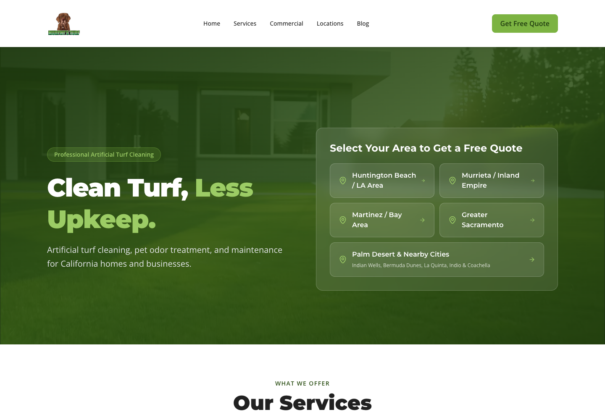

# Palm Desert expansion and sitewide SEO/AEO audit

September 12, 2026. **Implementation and local verification complete. Production and account-level results require separate evidence.**

## What changed

The homepage keeps its existing two-by-two area grid and gives Palm Desert a full-width fifth row. On small screens, all five areas remain individual full-width links. The service-area directory, footer, quote pickers, mobile call/quote sheet, metadata, sitemap, and AI-readable exports use the current area inventory. The mobile sheet scrolls on short screens, supports Escape and keyboard focus containment, and returns focus when closed.

The expansion adds **12 service pages and four original guides**: a Palm Desert residential hub and commercial hub, five neighboring community pages in each hierarchy, and four guides with distinct maintenance, odor, drainage, and property-management questions. New pages use service-area schema tied to the existing business, visible FAQs that match their schema, related services, and relevant local links. No office, address, project, testimonial, affiliation, or local performance statistic was invented.

The supplied map was treated as geographic context. Coverage centers on **Palm Desert, Indian Wells, Bermuda Dunes, La Quinta, Indio, and Coachella**, with **Sun City Palm Desert / Desert Palms** covered within the hub. Named neighborhoods appear within the relevant city page, with coverage confirmation for addresses near the approximate outer boundary. This does not expand coverage to all of the Coachella Valley. Geographic references are recorded in [the location data](../src/data/palm-desert.ts).

**Phone assumption:** the new area uses the existing Southern California number **951-331-3300**. No dedicated Palm Desert number was supplied during implementation. Quote forms submit the existing `palm-desert` region tag with the selected city. Source inspection shows the current lead function can accept that tag; live CRM delivery was not exercised.

## Audit results and repairs

The [technical audit](seo-aeo-technical-audit.md) records the source review and full read-only production crawl. The [editorial audit](seo-aeo-editorial-audit.md) records every older blog reviewed, completed URL-by-URL repairs, before/after repetition checks, and factual sources.

- **Production baseline:** 215 sitemap URLs (172 HTML pages plus 43 text files) returned 200. Seventeen broken article anchors and one broken location link were identified and repaired locally. Invalid-route probes returned actual 404s.
- **Technical repairs:** shared route/article inventories, reliable sitemap dates, canonical HTML sitemap entries, consistent crawler exclusions, server-rendered business schema, service-area identity, error-page canonical removal, corrected generated text, and removal of unsupported AI-authorship declarations. Optional text mirrors remain readable and receive noindex headers in Netlify configuration.
- **Content and usability repairs:** accurate five-area navigation, unique form IDs where multiple forms share a page, accessible form status messages, native homepage and regional FAQs, working blog jump/share links, removal of unfinished image placeholders, and a real guide link replacing the footer's signup form that did not send or store its input. Quote submission is disabled before hydration with a phone/contact fallback; native submission uses POST so contact fields cannot leak into a GET URL. Optional storage failures no longer break attribution or cookie controls.
- **Claim corrections:** shared services, company information, FAQs, old regional templates, metadata, and reusable marketing components now describe treatment planning and product-specific re-entry without universal safety or unnamed pathogen-elimination promises. Unsupported experience figures, customer counts, review/rating inventories, credentials, simulated before/after comparisons and the invented exit-popup discount were removed from marketing and structured data. The service-detail routes use the reviewed shared service inventory rather than independent, conflicting copy. These changes do not certify an unnamed product. [EPA product-label guidance](https://www.epa.gov/pesticide-registration/selected-epa-registered-disinfectants), [EPA pet guidance](https://www.epa.gov/pets/read-label-first-protect-your-pets), [FTC advertising guidance](https://www.ftc.gov/business-guidance/advertising-marketing/advertising-marketing-basics).
- **Legacy location content:** the existing residential/commercial coverage URLs retain their regional phone numbers and now use conditional coastal, inland, East Bay and Sacramento care guidance, geographic/access distinctions and facility-specific work planning. Fabricated local project history and arbitrary rotated segments were removed. New neighborhood names remain within useful city pages rather than becoming separate thin pages.
- **Performance and rendering:** the homepage uses an **836,458-byte video** (93.5% smaller than the original 12,922,331 bytes) and a **47,918-byte poster**. Mobile, reduced-motion, Save-Data, slow-connection and no-JavaScript views request no video. Desktop supports pause/play and blocked-autoplay fallback. Scroll content is visible in server HTML; animation is an optional enhancement. Counters display their actual values immediately. [Performance report](hero-media-performance.md).
- Restored the missing decorative `grid-pattern.svg` referenced by several page backgrounds. The manifest and logo were not broken; their declarations were consolidated for consistency.
- **Complete article review:** all **41 older articles** were rewritten around useful reader decisions, including all 17 original depth candidates and all 16 priority claim candidates. Their URLs and original publication dates are preserved, and review dates, titles, excerpts and reading times now match the revised text. The four Palm Desert guides remain included. Word counts and phrase-overlap diagnostics are recorded in the editorial report without treating them as ranking guarantees.
- **Final review repairs:** the four older commercial hubs now display the FAQs declared in their schema. Cookie acceptance is restored only for the exact stored `accepted` value, explicit choices queue before Google loads and take effect even if storage writes fail, absent or inaccessible stored choices default to denied, and client navigation avoids a duplicate initial pageview. Cross-tab changes synchronize the effective choice before attribution consumers run. These are source and simulated-queue checks, not a claim of live analytics delivery.
- **Release follow-up:** inherited social previews and shared structured data now use the five actual service regions. An unsupported price tier and commercial availability offer were removed. A link-graph check found every one of the 188 sitemap pages reachable from the homepage, with no orphan pages.
- **Quote attribution:** the actual shared form now preserves allowlisted campaign details across navigation after analytics acceptance, passes them to the lead function, and emits one non-PII `generate_lead` event only after a confirmed submission. The function preserves campaign context in a contact note while retaining existing CRM routing. Validation, duplicate-submit prevention and safe logging were strengthened. Note delivery and Analytics/Ads receipt require live verification; local tests simulate the external endpoints. [Lead QA details](lead-attribution-qa.md).
- **Accessibility follow-up:** low-contrast links and buttons were corrected within the existing palette, form and climate headings were put in order, cookie preferences received a named landmark, and the blog contents navigation no longer sits under the fixed header. The bright sage CTA fill remains, with darker text for readable contrast.

## Verification

| Check | Result |
| --- | --- |
| Production build | Passed; static export completed |
| Netlify function bundle | `netlify functions:build` passed locally |
| Full test suite | **859 passed across 72 files; no TODOs** |
| TypeScript | `npx tsc --noEmit` passed |
| Exported site crawl | **188/188 HTML sitemap pages returned 200; zero detected issues** for title/description uniqueness, canonicals, H1s, parsed JSON-LD, FAQ/schema content alignment, index controls, internal links/anchors, duplicate IDs, linked resources, redirects and 404 probes |
| Browser checks | 320, 360, 390, 768, and 1440 pixel widths; no horizontal overflow; balanced fifth area; both mobile pickers include Palm Desert; all 16 new pages load |
| Lead-form simulation | Empty-field validation, simulated server failure, retained input, retry, success, and correct region/city payload passed; **zero real submissions** |
| Campaign/conversion browser simulation | Accepted, declined, and blocked-storage acceptance passed across homepage-to-Palm-Desert navigation; failures record zero conversions and consented confirmed submissions record exactly one; all external requests blocked |
| Automated accessibility | **12/12 exported-page checks reported zero axe violations** across six representative routes at 390 and 1440 pixels; gradients/translucency and an external map remain incomplete checks, so this is not full WCAG certification |
| JavaScript-disabled check | New and old location content visible; native FAQs open and close; submit remains disabled with contact guidance |
| Browser runtime | No uncaught page errors in checked flows |
| Repository ESLint | **Zero errors and warnings** |
| Diff whitespace | `git diff --check` passed |

The local export server simulated clean URLs and the redirects/text headers in `netlify.toml`; this is not a production deployment check. Evidence: [local crawl](audits/2026-09-12-local-seo.json), [browser QA](audits/2026-09-12-browser-qa.json), [campaign/conversion browser QA](audits/2026-09-12-attribution-browser-qa.json), [accessibility checks](audits/2026-09-12-accessibility-axe-after.json), [media scenarios](audits/2026-09-12-hero-media-qa.json), [progressive rendering](audits/2026-09-12-progressive-motion-qa.json), [article browser checks](audits/2026-09-12-editorial-browser-qa.json), [production baseline](audits/2026-09-12-live-seo-baseline.json).

Initial build/type validation exposed existing missing Vitest global types, unnecessary dot-all regex flags in tests targeting ES2017, and incorrectly shaped UTM test fixtures. These narrow test fixes allow type checking and the production build to run without suppressing checks.

The original active-checkout lint baseline had **41 errors and 23 warnings**; archived worktree/tool copies added more unrelated results. Actual source/test errors were repaired, redundant mocks and unused imports removed, and effect-based state synchronization replaced with stable external-store subscriptions. Lint excludes only generated output and archived tool/worktree directories; no rules were disabled globally. One documented local exception preserves Google's standard `arguments` queue format. The three old page-test TODOs now exercise real routes; duplicated metadata test cases were consolidated around shared inventories.

## External verification and business facts

1. **Authentic business evidence:** marketing no longer publishes unsupported testimonials, statistics or credentials. Verified project photos, customer reviews and actual treatment details can strengthen future updates, but those facts cannot be manufactured. The Terms service description was corrected to the shared artificial-turf services and the irrelevant seeding example removed. Existing contractual payment, cancellation, insurance and workmanship-guarantee terms were preserved; their approval and enforceability were not established by this SEO audit.
2. **Field performance:** the large video and loading/fallback defects are repaired and browser-tested. Search Console/CrUX field Core Web Vitals still require account or field evidence; file-size reduction is not a claimed field-performance score.
3. **Business confirmation and release:** confirm the new-area phone and edge-of-boundary coverage. Terms and Privacy list `info@murphysturfcare.com` and `26323 Jefferson Avenue, Murrieta`, while the shared company/footer use `info@murphysturf.com`; the correct legal contact details were requested and remain unconfirmed. The user has authorized release. Check live redirects, noindex headers on text mirrors, indexing, and lead delivery after deployment. The pre-release read-only check found the Palm Desert hub returning **404** on production and no Palm Desert entry in the live 215-URL sitemap. No messages or real leads were sent during local verification. GHL account setup is delegated to Claude in the [handoff](ghl-palm-desert-handoff.md).
4. **Search measurement:** Search Console/Bing Webmaster indexing, manual actions, query performance, Business Profile coverage, analytics attribution, and actual AI citations were not verified. The available browser reached Search Console's unauthenticated introduction, and no matching production project or CRM credentials were available for a live delivery test. These require account-level evidence. Useful, accurate, crawlable pages remain the basis for AI-search inclusion; special AI files do not guarantee visibility. [Google AI search guidance](https://developers.google.com/search/docs/appearance/ai-features).

## Visual review

[Homepage desktop](audits/hero-desktop.png) · [Homepage mobile](audits/hero-mobile.png) · [Palm Desert desktop](audits/palm-desert-desktop.png)

## New routes

- `/blog/artificial-turf-cleaning-palm-desert`
- `/blog/desert-turf-dust-drainage-coachella-valley`
- `/blog/pet-turf-odor-palm-desert`
- `/blog/seasonal-home-commercial-turf-palm-desert`
- `/commercial-turf-cleaning/palm-desert`
- `/commercial-turf-cleaning/palm-desert/commercial-turf-cleaning-in-bermuda-dunes`
- `/commercial-turf-cleaning/palm-desert/commercial-turf-cleaning-in-coachella`
- `/commercial-turf-cleaning/palm-desert/commercial-turf-cleaning-in-indian-wells`
- `/commercial-turf-cleaning/palm-desert/commercial-turf-cleaning-in-indio`
- `/commercial-turf-cleaning/palm-desert/commercial-turf-cleaning-in-la-quinta`
- `/locations/palm-desert`
- `/locations/palm-desert/turf-cleaning-in-bermuda-dunes`
- `/locations/palm-desert/turf-cleaning-in-coachella`
- `/locations/palm-desert/turf-cleaning-in-indian-wells`
- `/locations/palm-desert/turf-cleaning-in-indio`
- `/locations/palm-desert/turf-cleaning-in-la-quinta`
